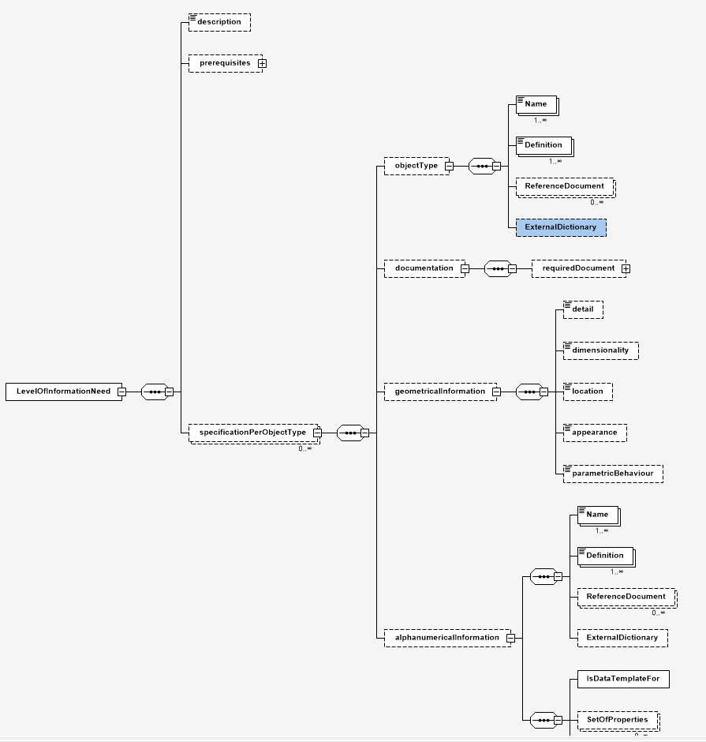

# LOIN-XML-Schema

The schema for exchanging Level of Information Need (LOIN) specifications according to EN17412-3.

**Warning** The information, data sets and examples you find here are heavily work in progress. The ISO committee members use these to discuss and evaluate different approaches to capture LOINs.
**__The data sets found here are not yet final and should not be used in production__**. They do not represent common argreements (yet).

Please feel invited to contribute through issues or code!

## TODOs

- [ ] decide on `lowercase`, `PascalCase`, or `camelCase` spelling for attributes and element definitions
- [ ] closely coordinate with EN ISO 23387 (DT) and ISO 12006 (bSDD) committees
- [ ] enable three models of alphanumeric information need definitons: a) inline/ad hoc for standalone LOINS b) refer to DT instances c) refer to concept definitions in bSDD and other repositories for measures, units, properties etc. . __encourage and enable reuse of concepts__
- [ ] evaluate LinkedData (RDF(S), OWL) approaches. The current XML Schema solutions are much focused on serialization, less on modelling. IRIs/URIs for concepts might be a more useful solution than bespoke `targetUUID` references.
- [ ] ...
- [ ] Profit!
